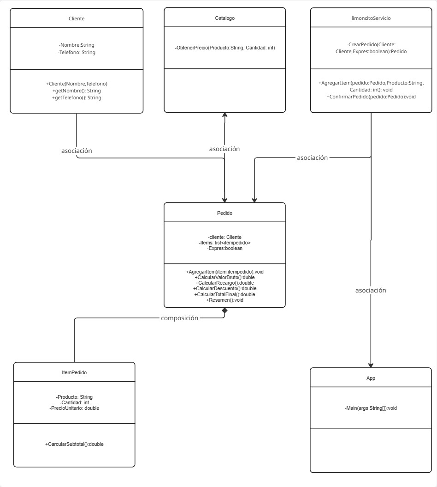
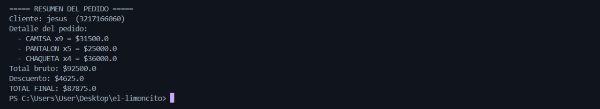
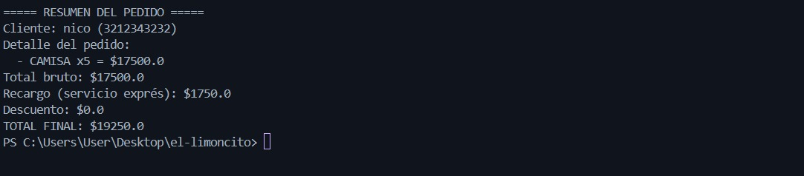
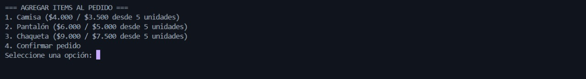

# Lavandería “El Limoncito”

Cada tarde, El Limoncito recibe clientes que dejan su ropa para recoger el mismo día. El módulo debe registrar nombre y teléfono del cliente y crear una orden con ítems de un catálogo fijo de hoy: Camisa ($4.000, o $3.500 c/u si dejan 5 o más), Pantalón ($6.000, o $5.000 c/u desde 5), y Chaqueta ($9.000, o $7.500 c/u desde 5). El cliente puede marcar la opción “servicio exprés”, que agrega un recargo del 10% al total. El cálculo debe hacerse así: primero subtotales por ítem usando precio por volumen cuando aplique; luego sumar para obtener el total bruto; si es exprés, agregar el 10%; al final, si el total resultante supera $60.000, aplicar descuento del 5% (una sola vez). No se permiten cantidades ≤ 0 ni totales negativos. Al confirmar la orden, no se puede editar y se debe generar un resumen claro (cliente, detalle con precio aplicado, total bruto, recargo, descuento y total final). No hay pagos ni inventario: solo tomar la orden, calcular y confirmar para agilizar la entrega.

# 1-recrerimientos:

rf1-registrar cliente(nombre,telefono) 
rf2- crear el pedido (pedido)
rf3- agregar items de catalogo(producto,cantidad)
rf4- usar volumen si el pedido tiene mas de =>5
rf5- calcular el total (subtotal> 60k se le palica un descuento del 5%)
rf6- confirmar el pedido y no se puede editar con el resumen claro 
rf7- validar las cantidades que no pueden >0
rf8- listar resumen: precio (cabecera, total,subtotal ) descuentos al final

# 2-reglas del negocio:
catalogo fijo:
    -camisas=4000 / volumen 3500
    -pantalon=6000 / volumen 5000
    chaquetas=9000 / volumen 7500

-servicio expres + 10% al total 
- total > 60k descuento 5%
-no se permiten cantidades =<0 o negativos 

# 3-criterios de aceptacion 
ca1-volumen= dado x5 calculo el subtotal y uso 3500 no 4000
ca2-descuento= dado calcular el total y supera 60k se hace un decuento de 5%
ca3-bloqueo = dado que el pedido esta listo no se puede hagregar items 
ca4-expres = dado calcular el total y sumar un 10% al total final 

# 4-limite del diseño
-liente (entidad simple)
-roducto (puede ser enum con precios del dia)
-tem de pedido (producto + cantidad, según el subtotal según el volumen )
-edido(compone itempedido, conoce estado, calcular total + decuento, confirmacion)
-imoncitoservice (coordina casos de usu: crear pedido, agregar item, confirmacion )

# 5-estructura modular :

el-limoncito/
│
├── src/
│   ├── dominio/               
│   │   ├── Cliente.java
│   │   ├── Producto.java     
│   │   ├── ItemPedido.java    
│   │   └── Pedido.java       
│   │
│   ├── servicios/              
│   │   └── LimoncitoServicio.java
│   │
│   └── app/                   
│       └── App.java
│
├── README.md
└── .gitignore

